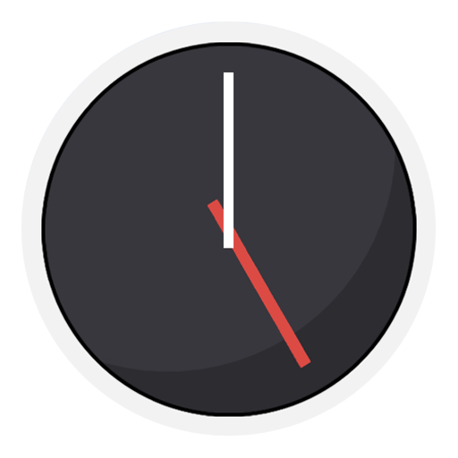

# Часы | Clock

### Функционал | Functionality

- Будильники (с выбором дней недели)
- Напоминания (пользователь выбирает периодичность)
- Таймер

#### Будильники и напоминания реализованы с помощью уведомлений, и с периодичностью в 1 день обновляются на 2 дня вперед при помощи пакета <a href="https://pub.dev/packages/background_fetch">background_fetch</a>, а также при запуске приложения и обновлении будильников и напоминаний.

### Пакеты | Packages
- flutter_bloc
- google_fonts
- intl
- hive
- hive_flutter
- path_provider
- uuid
- flutter_timezone
- rate_limiter
- background_fetch
- simple_circular_progress_bar
- just_audio
- flutter_native_splash
- awesome_notifications
- app_launcher
- is_lock_screen
- slide_action
- hive_generator
- build_runner